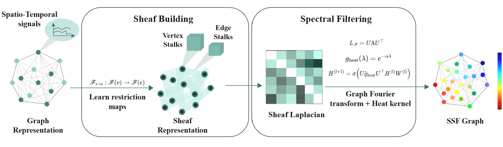
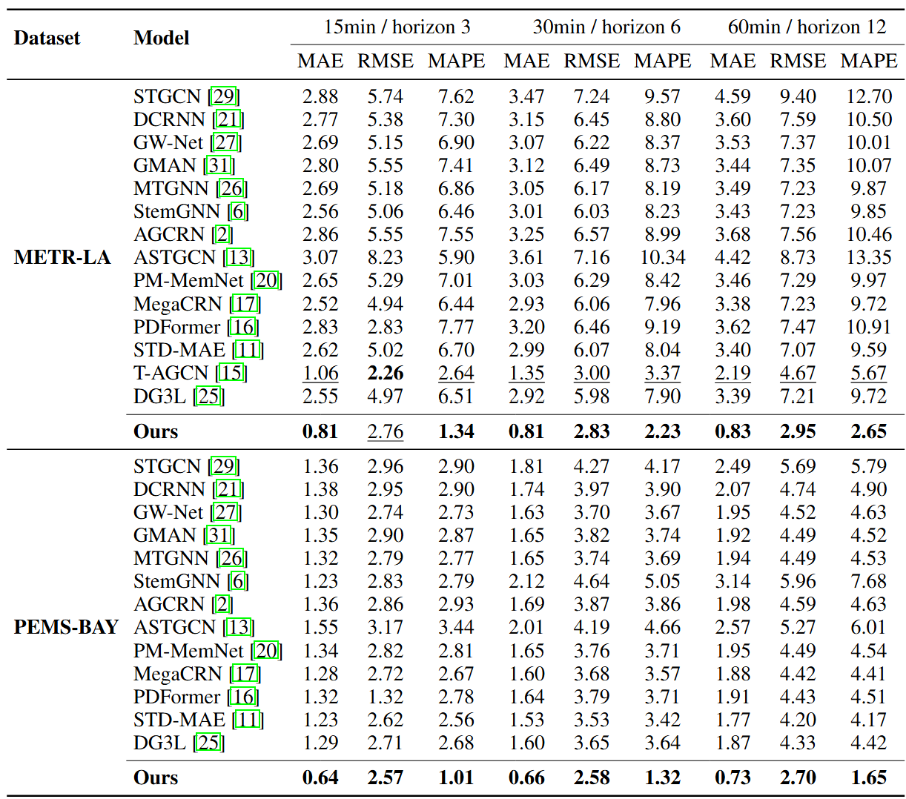

# Spectral Sheaf Filtering: A Topological Approach to Spatio-Temporal Modeling

This repository contains the official implementation of our paper, submitted for review.

## Overview

We propose **Spectral Sheaf Filtering (SSF)** — a novel method that utilizes **sheaf theory** and **spectral graph filtering** to model spatio-temporal dependencies in structured data. SSF introduces a topological perspective into the design of neural networks for graph-based spatio-temporal prediction, outperforming state-of-the-art baselines on multiple benchmarks.

<p align="center">
  
</p>


### Dependencies

```
pip install -r requirements.txt
```

Note: torch-geometric and its associated packages (torch-scatter, torch-sparse, torch-cluster) often require specific installation due to their dependency on the PyTorch version and CUDA compatibility. It's recommended to follow the official installation instructions provided by the PyTorch Geometric documentation to ensure proper setup.
The sheaf building functions and diffusion models are based on the public repository: https://github.com/IuliaDuta/sheaf_hypergraph_networks.

### Download Datasets

All the used datasets are publicly available. You can download METR-LA and PEMS-BAY datasets from [this link](https://drive.google.com/drive/folders/10FOTa6HXPqX8Pf5WRoRwcFnW9BrNZEIX), Naver-Seoul dataset from [this link](https://drive.google.com/drive/folders/1HjpDu7EjBKvA2e7WrsyPZGFEJL5PhzeG), and PEMS04, PEMS08 from [this link](https://github.com/divanoresia/Traffic)

The dataset folders should be structured as:
```
Datasets
   ├─horizon_3
   ├─horizon_6
   ├─horizon_12
   |    ├─PEMS04
   |    ├─PEMS08
   |    ├─METR-LA
   |    ├─PEMS-BAY
   |    ├─NAVER-Seoul
├─run.py
```
### Run the experiments
Specify the dataset name and prediction length (horizon 3 = 15 mins, horizon 6 = 30 mins, horizon 12 = 60 mins). Check run.py to control other parameters.
```
python run.py --model_id metr_12 --data_name METR-LA --horizon 12

python run.py --model_id pems_bay_12 --data_name PEMS-BAY --horizon 12

python run.py --model_id pems04_12 --data_name PEMS04 --horizon 12
```
### Results

<p align="center">
  
</p>
